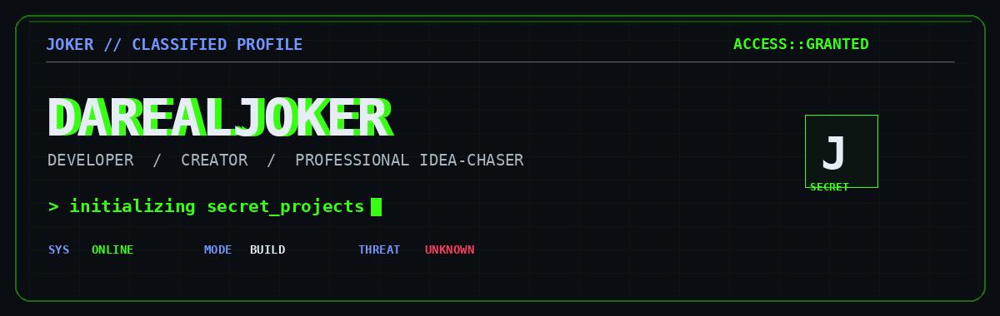

<div align="center">

# 🃏 DaRealJoker

### `I like doing funny stuff.`


</div>

---

<div align="center">



### 🃏 `WHO AM I?`

> **Developer. Creator. Problem Solver.**
>
> I build things because I can.
>
> I break things because I want to know why they broke.
>
> And sometimes... I make something completely unnecessary just because it's funny.

</div>

---

## 🧪 What I'm cooking

```text
┌──────────────────────────────────────────────────────────────┐
│                                                              │
│   🎮 GAME DEVELOPMENT                                        │
│   └── Godot • C# • 2D • Roguelikes • Strategy               │
│                                                              │
│   ⚙️ SOFTWARE DEVELOPMENT                                    │
│   └── C# • TypeScript • Tauri • Desktop Applications        │
│                                                              │
│   🎨 DIGITAL CREATION                                        │
│   └── Vector Art • UI Design • Game Assets                   │
│                                                              │
│   🧠 CURRENTLY                                               │
│   └── Turning ideas into things that actually run            │
│                                                              │
└──────────────────────────────────────────────────────────────┘
```

---

# 🎮 Current Projects

### 🌑 Hollowbloom

> **Dark Fantasy • Action RPG • Industrial Horror**

A dark world filled with ruined industry, strange energy and things that probably shouldn't be alive.

**Engine:** Godot 4  
**Language:** C#  
**Style:** Dark Fantasy / Industrial / Hand-crafted Visuals

```text
████████████████████░░ 90%

Idea        ████████████████████
World       ███████████████░░░░░
Combat      ████████████░░░░░░░░
Art         ██████████░░░░░░░░░░
Polish      ████░░░░░░░░░░░░░░░░
```

---

### ⚙️ PartsPilot

> **Cars. Parts. Data. One place.**

A desktop application designed around finding vehicle parts without turning the process into archaeological research.

**Stack:** Tauri 2 • TypeScript

```text
Vehicle
   ↓
Select Part
   ↓
Find compatible component
   ↓
🔧 Parts
   ↓
🛒 Shop
```

---

# 🛠️ Tech Arsenal

<div align="center">

### Languages


### Game Development


### Desktop & Tools


</div>

---

# 🃏 The Philosophy

```text
           ┌─────────────────────┐
           │      HAVE IDEA      │
           └──────────┬──────────┘
                      │
                      ▼
              ┌───────────────┐
              │ "Can I build  │
              │    this?"     │
              └───────┬───────┘
                      │
                     YES
                      │
                      ▼
              ┌───────────────┐
              │ BUILD IT      │
              └───────┬───────┘
                      │
                      ▼
              ┌───────────────┐
              │ BREAK IT      │
              └───────┬───────┘
                      │
                      ▼
              ┌───────────────┐
              │ FIX IT        │
              └───────┬───────┘
                      │
                      ▼
              ┌───────────────┐
              │ MAKE IT COOL  │
              └───────┬───────┘
                      │
                      ▼
                 🚀 SHIP IT
```

---

## 📊 GitHub Activity

<div align="center">


</div>

---

<div align="center">

### 🟢 Currently online

`████████████████████████████████████████`

**Building things. Breaking things. Learning things.**

<br>

> *"Why make something normal when you can make it interesting?"*

<br>

🃏 **DaRealJoker**

</div>


